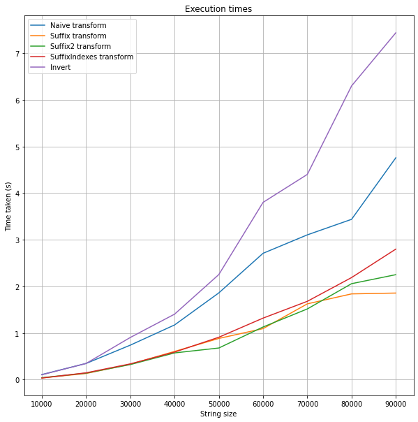

Burrows wheeler transform (BWT)

Here is naive BWT implementation and multiple that use suffixes.
Also includes inversion methods, one being a lot faster than the other.
Execution times differ quite a lot between PC and Colab machine, but best performance is gained using any Suffixes BWT and invertTransformFaster for inversion.

```
BWT = BWTSuffixesIndexes()
text = "banana"
print(f'Input: {text}')
transformed = BWT.transform(text)
print(f'Transformed: {transformed}')
inverted = invertTransformFaster(transformed)
print(f'Inverted: {inverted}')
```
Execution times on my PC


Execution times on Colab


